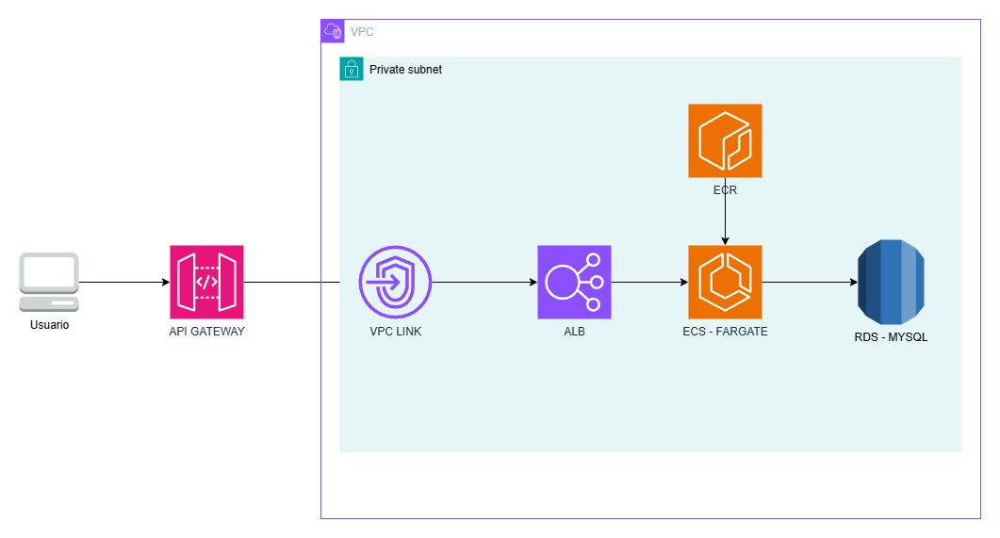

### Built With

* 
* 
* 
* 


## Para Empezar

Para tener una copia local en funcionamiento, siga estos pasos.

### Pre Requisitos

* JDK 17 [https://jdk.java.net/java-se-ri/17](https://jdk.java.net/java-se-ri/17)
* Gradle [https://gradle.org/install/](https://gradle.org/install/)
* MySQL [https://dev.mysql.com/downloads/installer/](https://dev.mysql.com/downloads/installer/)

### Herramientas Recomendadas
* IntelliJ Community [https://www.jetbrains.com/idea/download/](https://www.jetbrains.com/idea/download/)
* Postman [https://www.postman.com/downloads/](https://www.postman.com/downloads/)

### Installation

1. Clona el repo
2. cambia al directorio
   ```sh
   cd franquicia
   ```
3. Crea una nueva base de datos en mysql, local o en la nube usando el archivo `rds.yml` en cloudformation,
   añadir minimo dos subredes antes de desplegar

```yml
     DBSubnetGroup:
     Type: AWS::RDS::DBSubnetGroup
     Properties:
        DBSubnetGroupDescription: Subnets para RDS
        SubnetIds:
           - subRed1
           - subRed2
```
4. Despues de crear la base de datos, acceder a ella y crear las tablas, acontinuacion el codigo  sql

````
   CREATE TABLE franquicias (
   id INT AUTO_INCREMENT PRIMARY KEY,
   nombre VARCHAR(255) NOT NULL
   );
   
   CREATE TABLE sucursales (
   id INT AUTO_INCREMENT PRIMARY KEY,
   nombre VARCHAR(255) NOT NULL,
   franquicia_id INT,
   FOREIGN KEY (franquicia_id) REFERENCES franquicias(id)
   );
   
   CREATE TABLE productos (
   id INT AUTO_INCREMENT PRIMARY KEY,
   nombre VARCHAR(255) NOT NULL,
   stock INT NOT NULL,
   sucursal_id INT,
   FOREIGN KEY (sucursal_id) REFERENCES sucursales(id)
   );
````
4. Actualizar las configuraciones de bases de datos con los datos necesarios 
   ```yml
   # src/main/resources/application.yml   
   spring:
      r2dbc:
         url: r2dbc:mysql://database-1.cdq608ijs.us-east-1.rds.amazonaws.com/franquiciadb
         username: admin
         password: admin1234
   ```

5. En el aplicativo postan importar el archivo `franquicia.postman_collection.js` para ejecutar
   los respectivos endpoint

## Docker Imagen

1. Para tener la imagen docker se debe ejecurar los siguientes comandos
````
   docker build -t franquicia .
   docker run -p 8080:8080 franquicia
````
   Tambien podra usar la misma coleccion de postan mencionada anteriormente (`franquicia.postman_collection.js`)

<!-- USAGE -->
## Usage

1. Dar click en la class MsFranquiciaApplication y seleccionar Run

## Despliegue

1. El despliegue realizado fue el siguiente, no se dejan url para consumir por
   cuestiones de costos, pero al momento de sustentar se tendra incorporada para
   su sustentacion




